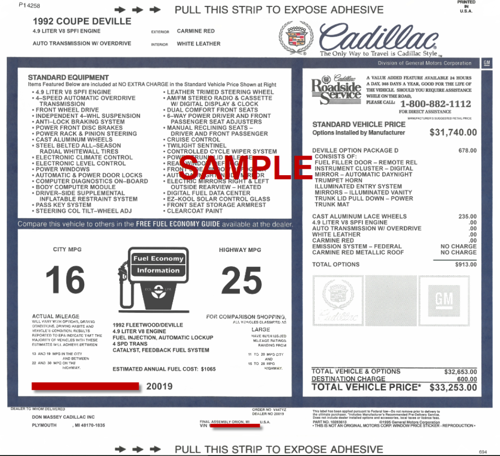

# Cadillac Reproduction Window Stickers   FAQs

This will provide a list of Frequently Asked Questions for obtaining a Window Sticker. ***Please review prior to ordering!***

## What years of window stickers do you reproduce?
  1980-1992*. Other years (1959-1979, 1993-1999) are also available but would be on a case by case basis as it would depend on information available. I am always working to accumulate more copies of original stickers for these years. Feel free to [email me](mailto:skutsenkow@gmail.com) or [Private Message](https://www.facebook.com/CadillacWindowStickers) me on Facebook to see if your vehicle is available!   
  ***Click [What do I need...](#What-do-I-need-to-do-to-get-a-window-sticker-made?) section below on what information is required for each year.***
 
## How long does it take to make a window sticker?
  Depending on demand and volume of work, I can typically have a preview of what your sticker will look like finished and emailed to you with a two week period. Upon your review, approval and payment, I will print the sticker out and mail shortly after.  
## What if my sticker gets damaged or lost, can I get a replacement?
  Certainly. Your sticker is digitally saved and backed up. A replacement sticker costs $15 which includes shipping. Currently my stickers are printed on card-stock and trimmed to closely match the size of the original. I apologize but I do not have a way to print these on form paper. I also highly recommend having the sticker laminated for added protection! 
## How close to the original is the reproduction sticker?
  The <i> templates </i> I use to build your sticker are a lot of times produced from original stickers that have been scanned at a high resolution. The font type that is used is ***EXTREMELY*** close to the original. I also have over 200+ original stickers of various years and models to assist in making sure your sticker is as accurate as possible. 
All information including factory options, prices and codes are based off original Window Stickers, vehicle invoices and Data Books on file. Keep in mind that car prices (including destination charge) along with their option pricing fluctuated throughout the year. I make every attempt to price the sticker as best as I can.  

***NOTE - Specific numbers such as a sequence numbers or routing numbers can only be added to the reproduction if an original window sticker or build sheet has been provided. While obtaining an original GM vehicle invoice helps to provide the majority of information about your car, it unfortunately does not provide this type of information.*** 

***NOTE - Dealership information pertaining to where the car was originally sold/delivered is listed on a vehicle invoice or a build sheet. If either of these is not available for your car, then other forms of documentation can be provided by the customer to ensure the dealership info is accurate (e.g. Original bill of sale, dealership cards, dealer badges, engine compartment, CarFax, etc.). <u> Be aware that I cannot simply add any dealership.*** </u>  
##  What kind of paper is the window sticker printed on?
  Original window stickers came in various shapes and sizes but a lot were 9x12 or 10x12 and printed on form paper. Currently my stickers are printed on card stock and closely match the size of the original. I apologize but I do not have a way to print these on form paper. I high recommend having the sticker laminated.   
 ***Disclaimers:***  
  • Be advised that using copies of original window stickers as templates means that the final product could have an "aged" look to it. I do my best to clean them up and make presentable. I personally think this gives them a more realistic look and feel!
    • All reproduced window stickers will have a written disclaimer at the bottom that reads: "This is not an original General Motors Corp. Window Price Sticker - Reproduction". This is to protect myself and the authenticity of the car, especially if it was ever being judged for a contest. No exceptions!
## What is the price for a window sticker?
  Window stickers cost $60 ($5 for each additional copy) and $15 for a replacement. $5 lamination fee for each print (optional). $10 shipping and handling. PayPal is the preferred form of payment.
## What do I need to do to get a window sticker made?  
  In order to reproduce an accurate window sticker, ***one*** of the following will be <u>required</u> at minimum: 
- An original window sticker
- Original build sheet
- Vehicle Invoice
  
 
 Providing one of these documents eliminates listing options or information that was never installed on the car. This ensures your sticker is as accurate as possible. You can obtain this information from the GM Media Archive (http://www.gmmediaarchive.com/). Vehicle invoices are available for years 1980-present and Build sheets are available for years 1903-1980 excluding 1968, 1974-1979 and some 1973 models. It’s always best to have your build sheet decoded when ordering.

With that said, there are exceptions to the rule as not every car will have this information available. If your car’s year falls within one of the years that has NO information available (such as a build sheet for a 1979), I can direct you to a full listing of options for your car and you can choose which ones are applicable. If you possess other pieces of information (e.g. Bill of sale, receipts, body/cowl tag, dealership cards, etc.) that would be beneficial in making your sticker more accurate, feel free to include that as well. 
Ready to have a window sticker created? Email skutsenkow@gmail.com and provide the following: 

- First Name:  
- Last Name: 
- Shipping Address: 
- Phone Number: 
- E-mail Address: 
- Vehicle Year/Model:  
- Complete VIN: 
- Number of Copies: 
- Number of Laminated Copies ($5 each): 
- New or Replacement: 
 
***Please also attach a copy of your vehicle build sheet, vehicle invoice or an original sticker.***

Also consider visiting Facebook to view sample photos and testimonials. 
https://www.facebook.com/CadillacWindowStickers